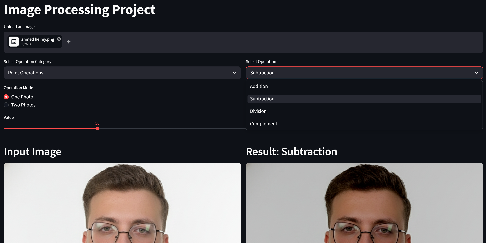
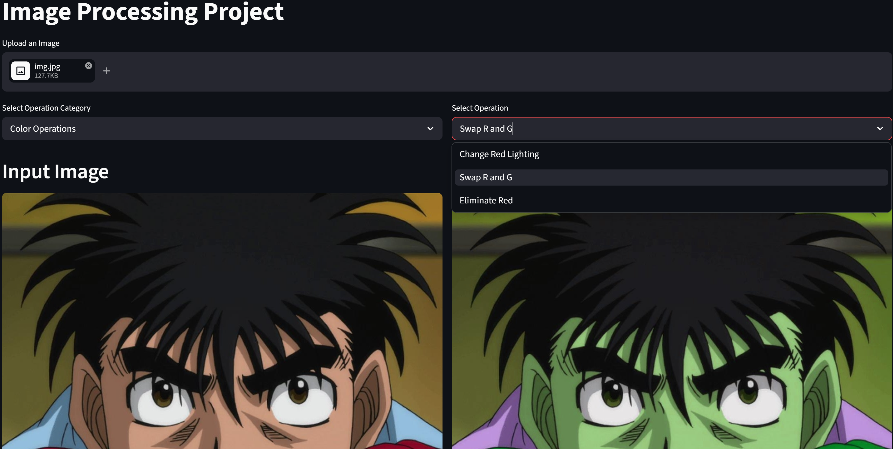
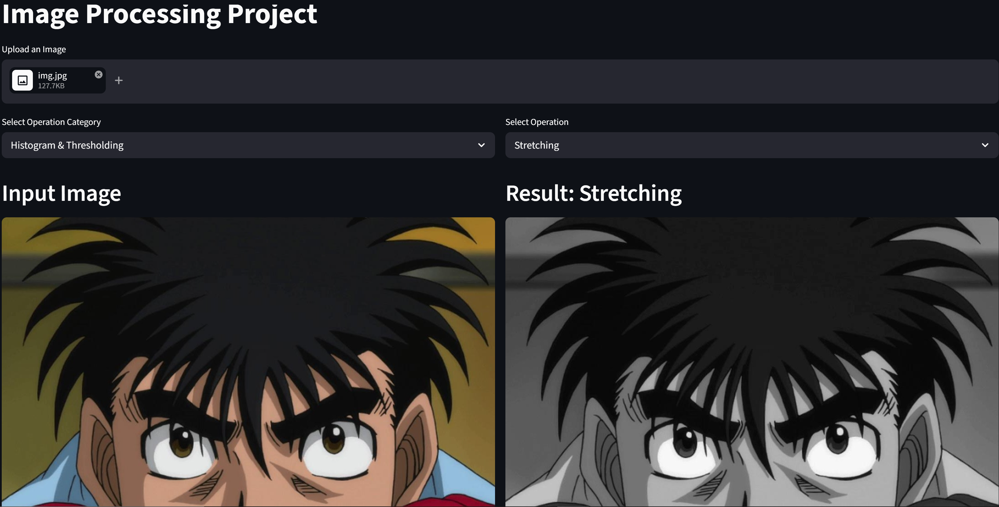
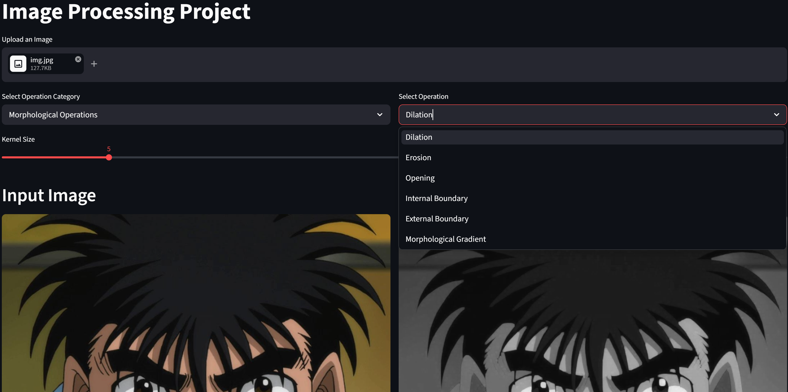

# 🖼️ Digital Image Processing Tool

An interactive web application built with Streamlit that covers 8 major Digital Image Processing categories. Upload any image and apply a wide range of custom-built algorithms through a clean, side-by-side GUI — input and result displayed instantly.

---

## 🎬 Demo

[](your-linkedin-video-link-here)

---
## 🖼️ Screenshots

| Point Operations | Color Operations |
|-----------------|-----------------|
|  |  |

| Histogram Processing | Morphology |
|---------------------|------------|
|  |  |
---

## ⚙️ Features

### 1. 🔢 Point Operations
| Operation | Description |
|-----------|-------------|
| Addition | Increase brightness or blend two images via `cv2.add` |
| Subtraction | Reduce brightness or subtract image details via `cv2.subtract` |
| Division | Safe division with zero-protection via `cv2.divide` |
| Complement | Invert image colors (negative effect) via `cv2.bitwise_not` |

### 2. 🎨 Color Image Operations
| Operation | Description |
|-----------|-------------|
| Change Red Lighting | Adjust red channel intensity via slider |
| Swap R to G | Swap red and green channels for color shift effect |
| Eliminate Red | Zero out red channel completely |

### 3. 📊 Image Histogram
| Operation | Description |
|-----------|-------------|
| Histogram Stretching | Manual implementation using min-max normalization formula |
| Histogram Equalization | Auto contrast enhancement via `cv2.equalizeHist` |

### 4. 🔍 Neighborhood Processing
| Filter | Type | Description |
|--------|------|-------------|
| Average Filter | Linear | Smoothing via `cv2.blur` |
| Laplacian Filter | Linear | Edge enhancement via `cv2.Laplacian` |
| Maximum Filter | Non-linear | Dilation effect via `cv2.dilate` |
| Minimum Filter | Non-linear | Erosion effect via `cv2.erode` |
| Median Filter | Non-linear | Salt & pepper removal via `cv2.medianBlur` |
| Mode Filter | Non-linear | Median-based approximation for noise reduction |

### 5. 🔧 Image Restoration
**Salt & Pepper Noise:**
- Add noise with user-controlled intensity
- Remove with: Average Filter · Median Filter · Custom Outlier Method

**Gaussian Noise:**
- Image Averaging (N noisy copies → `np.mean`) — more copies = cleaner result
- Average Filter on single noisy image

### 6. ✂️ Image Segmentation
| Method | Description |
|--------|-------------|
| Basic Global Thresholding | Fixed T value via slider |
| Automatic Thresholding (Otsu) | Auto optimal threshold from histogram |
| Adaptive Thresholding | Region-based threshold — handles uneven lighting |

### 7. 🔎 Edge Detection
| Detector | Description |
|----------|-------------|
| Sobel Detector | Horizontal + Vertical gradients combined via `cv2.addWeighted` |

### 8. 🔷 Mathematical Morphology
| Operation | Description |
|-----------|-------------|
| Dilation | Expand white regions — fills gaps |
| Erosion | Shrink white regions — removes small noise |
| Opening | Erosion → Dilation — removes small white noise |
| Internal Boundary | Original − Eroded image |
| External Boundary | Dilated − Original image |
| Morphological Gradient | Dilated − Eroded via `cv2.MORPH_GRADIENT` |

---

## 🏗️ Architecture

- **Frontend:** Streamlit with `st.columns(2)` for side-by-side input/result display
- **Backend:** Modular Python files — one per processing category
- **Navigation:** Smart selectbox with categorized operations

---

## 🛠️ Tech Stack


---

## 📁 Project Structure

```
digital-image-processing-tool/
│
├── main.py                 
├── point_operations.py      
├── color_operations.py     
├── Histogram.py            
├── filters_logic.py        
├── edge_detection.py       
├── morphology_logic.py    
├── screenshots/            
├── samples/               
├── requirements.txt
└── README.md
```

---

## 🚀 How to Run

```bash
git clone https://github.com/v7med7elmy-ai/digital-image-processing-tool.git
cd digital-image-processing-tool
pip install -r requirements.txt
streamlit run main.py
```

---
## 👥 Team

Built by a team of 5 AI Engineering students — Menoufia University.

| **Ahmed Helmy** ⭐ | GUI (main.py) · Point Operations · Morphological Operations |
**My Role: Core Developer**
- Built some of the Streamlit GUI including navigation structure and subplot display
- Implemented all Point Operations with single/dual-image support and safe division logic
- Implemented Morphological Operations: Dilation, Erosion, Opening, Boundary Extraction

| **Ammar Yasser** | GUI (main.py) · Edge Detection · App Integration & Linking |

| **Ahmed Saber** | Histogram Processing |

| **Abdulrahman Sobqy** | Filter Logic |

| **AbdelMonsef** | Color Operations · Morphological Operations |
---

## 👤 Author

**Ahmed Helmy** — AI Engineering Student
[GitHub](https://github.com/v7med7elmy-ai)
